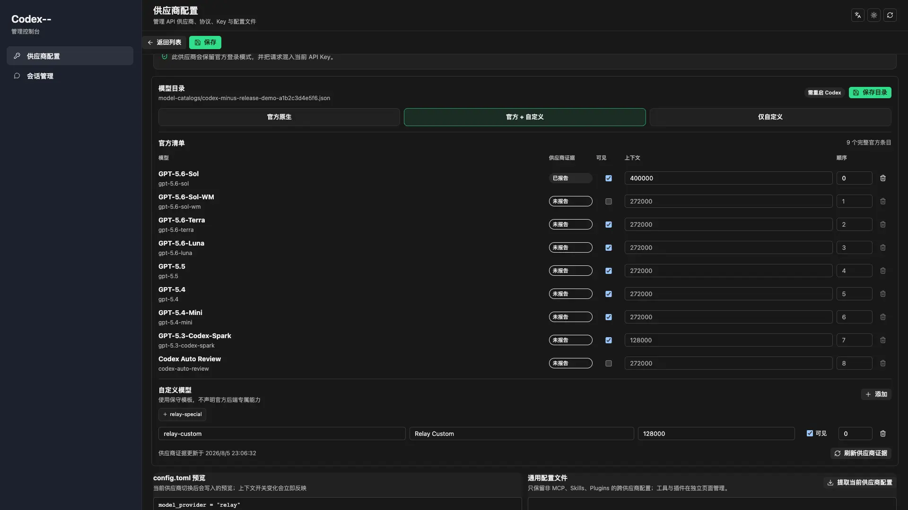

<p align="right"><a href="README.en.md">English</a></p>

<p align="center">
  
</p>

<h1 align="center">Codex-- Manager</h1>

<p align="center">安全切换供应商，管理模型目录，不交出你的 OAuth 与 Context。</p>

<p align="center">
  <a href="https://github.com/nxxxsooo/codex-minus/releases/latest"></a>
  
  
  <a href="LICENSE"></a>
</p>

Codex-- Manager 是 [Codex++ Manager](https://github.com/BigPizzaV3/CodexPlusPlus) 的精简 fork，只保留供应商切换、模型目录、本地会话生命周期和配置诊断。没有渲染注入、launcher、市场或自动更新器。

## 下载

支持 Apple Silicon（`arm64`）和 Windows（`x86_64`）。

| 平台 | 架构 | 格式 | 最新版本 |
|------|------|------|----------|
| macOS | arm64 | .app.zip | [v0.3.0](https://github.com/nxxxsooo/codex-minus/releases/latest) |
| Windows | x86_64 | .msi / .exe | [v0.3.0](https://github.com/nxxxsooo/codex-minus/releases/latest) |

- [前往 Release 页面下载](https://github.com/nxxxsooo/codex-minus/releases)
- [查看项目页面](https://mjshao.fun/codex-minus/)

```bash
# 校验 macOS
shasum -a 256 -c SHA256SUMS
```

校验后解压，将 `Codex-- Manager.app` 移入 `/Applications`。当前版本采用 ad-hoc 签名，尚未使用 Developer ID 签名或 Apple 公证。首次启动如被 macOS 拦截，请在「系统设置 → 隐私与安全性」中选择「仍要打开」。

## 为什么需要它

供应商切换只应该改供应商配置。Codex-- 会在每条写入路径执行前快照 `~/.codex/config.toml` 中的三张 Context 表，并在上游写入结束后把原始 TOML 内容逐字回植：

```toml
[mcp_servers]
[skills]
[plugins]
```

这层保护来自一次真实事故：旧的 managed context 副本在供应商切换时覆盖了有效 MCP 配置。Codex-- 删除了该管理功能，并用 Rust 测试固定保护契约。

## 功能范围

### 供应商切换

- ChatGPT OAuth 始终由官方 Codex/ChatGPT 客户端管理；供应商 profile 不保存、回填或应用 `authContents`。
- 纯 API 与混合供应商的 API Key 只写入 owner-only settings 和 `config.toml` 的 provider bearer 配置；供应商操作绝不写 live `auth.json`。
- settings、provider config、模型目录与 live 指针通过一个可恢复事务提交，失败时恢复完整上一代。
- 切换后读取实际 `model_provider`，相同 provider 不触发会话扫描。
- 检查可能覆盖供应商配置的 `OPENAI_*` 环境变量。
- 供应商快速测试与 Provider Doctor 遇到严格匹配的 Responses HTTP 400 字段兼容错误时，会在 Manager 内省略可选的 `max_output_tokens` 重试一次并明确标记；认证、模型、限流、普通上游错误和 Chat Completions 不重试。

### 模型目录

- Codex 在未配置静态 `model_catalog_json` 时，OAuth 或 API provider 都可能通过各自的 `/models` 路径更新共享 `models_cache.json`；混合模式会走当前 custom provider，因此该 live cache 具有 provider 歧义，不能作为官方基线。
- 官方清单只通过配置目标应用内、经过平台签名验证的 Codex CLI 刷新，不使用 `PATH` 中的任意 `codex`，也不把供应商 `/v1/models` 当作官方来源。
- 刷新在 owner-only 临时 `CODEX_HOME` 中运行，只投影当前 access/ID token；refresh token 为空，临时认证不会回写 live 状态。
- 每个可用供应商可选择「官方原生」「官方 + 自定义」「仅自定义」或「外部目录」。服务端复合供应商仍以一个纯 API Responses Base URL 和 Key 接入，模型聚合由上游完成，默认使用「官方 + 自定义」。
- 官方条目保留目标 CLI 返回的全部字段与隐藏模型；overlay 可管理显示名、可见性、顺序、上下文与有效百分比、推理级别以及显式工具能力。自定义模型默认不声明官方后端专属能力。
- 托管多模型目录以每个模型的上下文元数据为准；已有 `model_context_window` 和 `model_auto_compact_token_limit` 会先显示冲突，只有确认后才在可恢复事务中移除。
- 外部文件保持只读，采用前执行结构与目标 CLI 离线验证。目录声明版本与目标版本不同会显示警告并要求单独确认，但不会仅因版本字符串不同而拒绝兼容目录。
- 供应商 `/v1/models` 仅作为有时间戳的「已报告／未报告」证据和自定义候选；遗漏不会隐藏官方模型。
- 托管目录写入 `~/.codex/model-catalogs/codex-minus-<profile>-<hash>.json`。活动静态目录变化后会提示重启 Codex，不会自动结束或重启官方客户端。

### 会话生命周期

- 分页查看活动与已归档会话。
- 通过目标 Codex CLI 执行原生 `archive` 与 `unarchive`。
- 自动归档默认保留最近 30 天，首次启用前必须确认候选预览。
- 自动检查在界面可用后异步执行，最多每 24 小时完成一次。
- 删除会话前创建本地备份。

### Context 保护

- 供应商切换、应用、清除、活动保存和目录指针写入都经过统一 coordinator 与失败即关闭的 Context 事务。
- 写前快照、TOML 解析、回植、写后校验或恢复任一失败时，命令整体失败，不会报告伪成功。
- 不保存或合并 managed context 副本。
- 不恢复上游「工具与插件」管理页面。

## 更新与卸载

更新时先退出 Codex-- Manager，再下载最新版覆盖 `/Applications/Codex-- Manager.app`。应用不包含自动更新器，GitHub Release 不会自动更新本机副本。

用户设置位于 `~/.codex-session-delete/`，覆盖应用不会删除。卸载应用时可单独决定是否保留该目录。

## 已知限制

- 当前没有 Intel 构建、Developer ID 签名或 Apple 公证。
- Windows 构建通过 CI 自动生成，未在本地进行 Windows 实机测试。
- Credential-bearing 官方目录刷新当前验证下限为内嵌 `codex-cli 0.147.0-alpha.1`；已验证 macOS OpenAI Team ID `2DC432GLL2`。不支持 keyring-only 或无法安全读取的认证存储。
- Windows 已实现 Authenticode/OpenAI publisher gate，但尚未完成 Windows 实机 OAuth 刷新验证。
- 「Chat Completions 协议」和「本地成员聚合」依赖上游 launcher 提供的 `127.0.0.1:57321` 代理，本项目不包含该代理，请勿使用。由远端服务完成路由、对 Codex 仅暴露一个 Responses Base URL 和 Key 的服务端复合供应商不受此限制。
- 固定的上游 revision 尚未提供 active-only provider-sync 写入范围，因此「适配到当前 provider」保持禁用，不会回退到全历史改写。
- 会话归档用于整理，不会压缩数据或释放磁盘空间。

## 架构

- 前端：React 19、Vite、TypeScript。
- 桌面与后端：Tauri 2、Rust。
- 上游逻辑：`codex-plus-core` 与 `codex-plus-data`，固定到明确 git revision，不在本仓库 vendoring。
- 应用标识：`fun.mjshao.codex-minus`。
- 状态目录：`~/.codex-session-delete/`。

## 开发

```bash
npm install
npm run check
npm run vite:build
cd src-tauri && cargo test
npm run build
```

完整 Tauri 构建会生成：

- macOS: `src-tauri/target/release/bundle/macos/Codex-- Manager.app`
- Windows: `src-tauri/target/release/bundle/msi/*.msi` 或 `src-tauri/target/release/bundle/nsis/*.exe`

## License

AGPL-3.0-only，继承上游项目许可。
